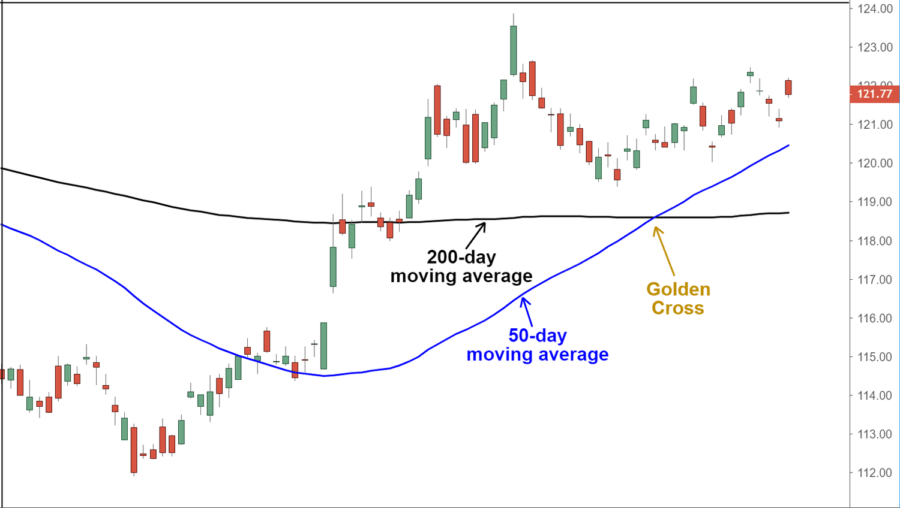
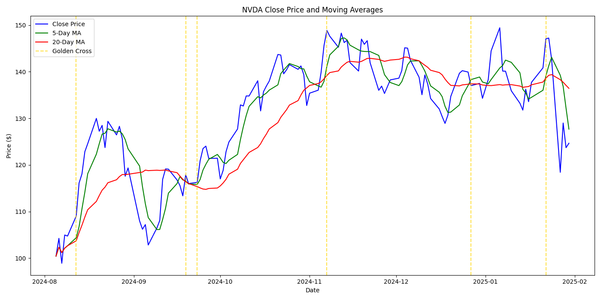
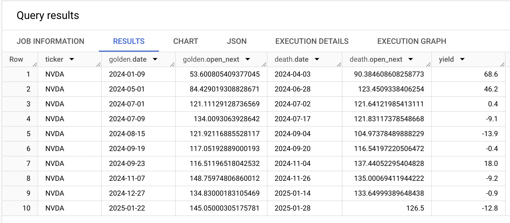
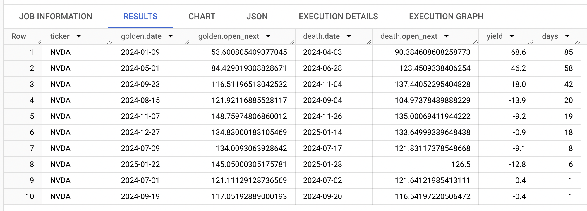

가격이 오르기 시작할 때 따라 사서, 그만 오르고 하락할 때 쯤 팔고 싶다. `가격이 오르기 시작할 때` 와 `그만 오르고 하락할 때` 를 포착하는 정량적 기준이 필요하겠다. 

`가격이 오르기 시작할 때` = `상승 추세 진입 시점을 파악하기 위한 방법` 으로 o1 은 **golden cross** 를 가장 먼저 얘기한다.

golden cross = 단기 이동평균선 (short-term moving average) 이 장기 이동평균선 (long-term moving average) 을 `아래에서 위로` 돌파하는 것을 얘기한다.

단기 이동평균선으로 몇일 이동평균선을 볼 것인지? 장기 이동평균선으로 몇일 이동평균선을 볼 것인지? 에 따라, 단기/중기/장기 중 어떤 golden cross 를 보는 것인지가 정해진다.

장기 golden cross (= 전통적 golden cross) 는 50일 이동평균선과 200일 이동평균선을 본다.

단기 golden cross 로는 5일 이동평균선과 20일 이동평균선을 본다. nvda 의 최근 단기 golden cross = 2025-01-22 였다.

이렇듯 이동평균선을 볼때는 보통 5의 배수로 보는데, 일주일 중 주말을 제외한 5일 동안 장이 열리기 때문이다.

golden cross 로 매수 타이밍을 잡았다고 치자. 매도 타이밍은?

반대로 death cross 라는 것도 있다. = 단기 이동평균선이 장기 이동평균선을 `위에서 아래로` 돌파하는 것을 얘기한다.

golden cross 와 death cross 에 기반하여, 아래와 같은 전략을 세웠다고 해보자.
> daily close (종가) 기준으로,
> - golden cross 가 발생하면 -> 다음 개장 때 시장가로 매수한다.
> - death cross 가 발생하면 -> 다음 개장 때 시장가로 매도한다.
> 
> ** 다음 개장 때 시장가로 매수/매도 = 과거 데이터로 볼때는 그날의 open (시가) 으로 매수/매도로 간주.

2024년 nvda 를 보면 수익률 (yield) 가 제각각이다. 최근 매수/매도 때는 -12.8% 로 크게 손실이다.

대략의 감상으로는, golden ~ death 기간이 길면 yield 가 높고 / 짧으면 yield 가 낮다.

golden ~ death 기간이 길다는 것은 그만큼 단기 이평선이 상승 돌파할 때 그 모멘텀이 강하다는 것 아닐까? 그러니 단순히 golden cross 가 발생하면 매수하는 게 아니라, 그 세기를 측정하여, 미약하면 hold 하고 / 일정 수준 이상으로 강하면 매수하는 식으로, 전략을 보완하면 좋겠다.

더 알아보자.
