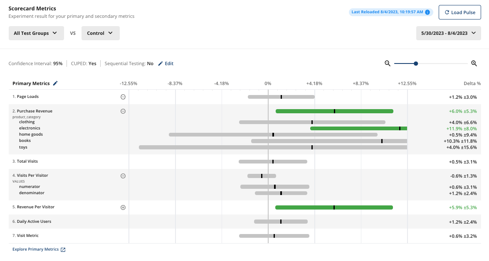

실험 결과를 일목요연하게 보여주는 view 가 있으면 좋겠다.

metric 들이 세로로 쫙 나열되고, metric 마다 control 대비 variant 의 lift 를 한 눈에 볼 수 있어서, 어떤 metric 들에서 유의미한 개선이 있었는지? 를 바로 파악할 수 있는.

[statsig](https://www.statsig.com/blog/experiment-scorecards-essentials) 나 [optimizely](https://support.optimizely.com/hc/en-us/articles/34053132157965-Understand-your-Experiment-Scorecard) 같은 대표적인 saas 들에서 이를 `scorecard` 라고 부른다.

